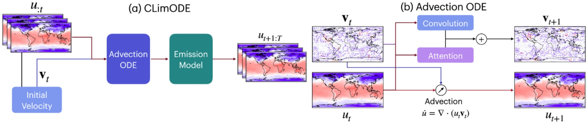

# ClimODE: Climate Forecasting With Physics-informed Neural ODEs

This repository is a reimplementation of the work [ClimODE](https://yogeshverma1998.github.io/ClimODE/) presented in the [ICLR 2024 Paper](https://openreview.net/forum?id=xuY33XhEGR) by Yogesh Verma, Markus Heinonen, and Vikas Garg. The original paper explores the application of Physics-informed Neural Ordinary Differential Equations (ODEs) for climate forecasting.

## Motivation

By reimagining the original PyTorch code within the PyTorch-Ignite framework, we aimed to enhance its scalability, readability, and adaptability. Leveraging distributed training capabilities and adhering to best practices in codebase organization, our goal was to facilitate efficient collaboration and maintain a clean, manageable codebase.

## Key Added Features

- **Framework Migration**: Transitioned the plain PyTorch codebase to the PyTorch-Ignite framework.
- **Distributed Training**: Enabled the use of distributed training for improved scalability.
- **Enhanced Readability**: Implemented coding standards, such as GitHub pre-commit hooks and EditorConfig, from the project's inception to ensure codebase consistency and readability.
- **Collaborative Tools**: Employed collaborative tools like GitHub pre-commit hooks and EditorConfig to foster effective collaboration and maintain codebase cleanliness.

## Acknowledgements

This project was undertaken as part of our deep learning master's course, with guidance from [Nicolas Baskiotis](https://www.isir.upmc.fr/personnel/baskiotis/) and [Laure Soulier](https://pages.isir.upmc.fr/soulier), our esteemed instructor.
We would also like to express our gratitude to Yogesh Verma, Markus Heinonen, and Vikas Garg for their pioneering work and for providing the inspiration for this project.

## Resources

- [The original paper](https://openreview.net/forum?id=xuY33XhEGR) for detailed insights into the methodology and findings.
- [Original repository](https://github.com/Aalto-QuML/ClimODE) of the paper.
- [Poster](report/poster.pdf): Our summarized version of the paper and view experimental results, including our own contributions alongside those of the original research.

### Summary of the Paper

The traditional approach to climate and weather prediction relies heavily on complex numerical simulations of atmospheric physics. Recent advancements in deep learning, particularly with models like transformers, have challenged this paradigm by offering complex network forecasts. However, these models often act as data-driven black boxes, neglecting underlying physics and lacking uncertainty quantification.

ClimODE addresses these limitations by introducing a spatiotemporal continuous-time process grounded in the principles of statistical mechanics, specifically the concept of advection—weather changes due to the spatial movement of quantities over time. By implementing value-conserving dynamics, ClimODE accurately models weather evolution while learning global weather transport as a neural flow. This approach enables effective uncertainty quantification in predictions.

## Getting Started

To get started with ClimODE, follow these steps:

1. Clone the repository to your local machine.
2. Install the necessary dependencies using `pip install -r requirements.txt`.
3. Explore the codebase and documentation to understand the implementation details and usage instructions.

## License

ClimODE is licensed under the [MIT License](LICENSE). Feel free to use and modify the codebase according to your requirements.
